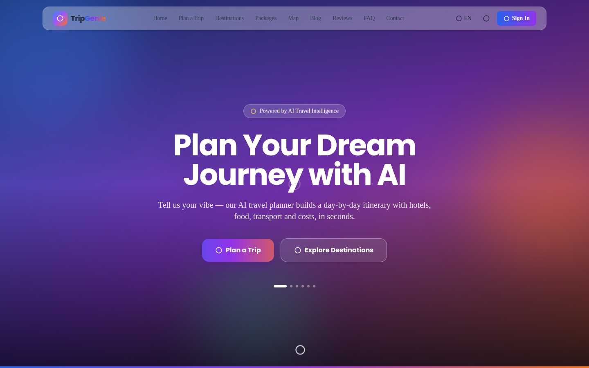
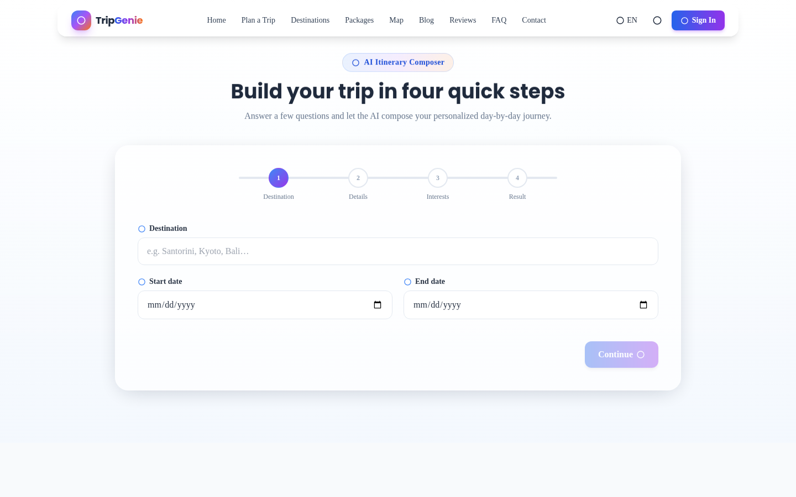
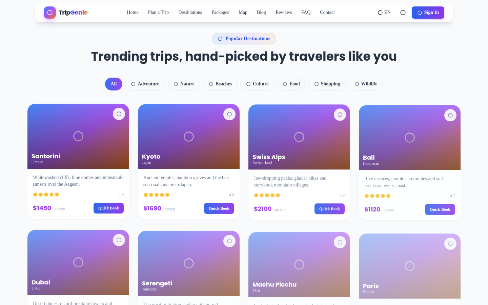

# 🌍 TripGenie



### An AI-Powered Trip Planning Platform

Built with React, Tailwind CSS & Recharts — Premium Glassmorphism UI


</div>

---

## 🎬 App Preview

| 🏠 Home | 🧭 AI Planner | 🌐 Destinations |
|:---:|:---:|:---:|
|  |  |  |

---

## ✨ Key Features

- 🤖 **AI Itinerary Composer** — a 4-step wizard (destination → budget/travelers/transport → interests → generate) that builds a day-by-day plan with activities, hotel & restaurant picks, mock weather, and per-day cost estimates
- 💰 **Budget Calculator** — total trip budget split across categories with self-balancing sliders and a live donut chart
- 💱 **Currency Converter** — quick conversion across 6 currencies
- ☀️ **Weather Preview** — mock 5-day forecast for any city
- 🎒 **Auto-Generated Packing Checklist** — tailored to your selected interests and trip length
- 🗺️ **Interactive Map** — OpenStreetMap embed centered on your destination, no API key required
- 🏝️ **Destination Explorer** — filterable cards with ratings, pricing, and a quick-book flow
- 📦 **Travel Packages** — curated tiers for couples, families, backpackers, and luxury travelers
- 📸 **Trip Photo Album** — upload and preview your own travel photos
- 📄 **Export & Share** — print-to-PDF itinerary export and clipboard trip sharing
- 🌗 **Dark / Light Mode** and 🌐 **English / Spanish / French** UI
- 👤 **Sign-In / Sign-Up**, favorites, reviews, blog, and FAQ sections

---

## 🛠️ Tech Stack

| Category | Technology |
|---|---|
| Frontend | React 19, JSX, Tailwind CSS v4 |
| Data Visualization | Recharts (bar & donut charts) |
| Icons | lucide-react |
| Build Tool | Vite |
| Mapping | OpenStreetMap (embedded, no API key) |
| UI/UX | Glassmorphism, gradient theming, scroll-reveal animations |

> No backend is wired up yet — authentication, saved trips, and photo albums currently live in browser session state only. See [Roadmap](#️-roadmap).

---

## 🚀 Getting Started

### 1. Clone & Install

```bash
git clone https://github.com/<your-username>/tripgenie.git
cd tripgenie
npm install
npm install recharts lucide-react
npm install tailwindcss @tailwindcss/vite
```

### 2. Run App ✅

```bash
npm run dev
```

### 3. Open Browser

```
> http://localhost:5173
```

### 4. App Link

> https://tripgenie-ai-app.netlify.app
---

## 📁 Project Structure

```
tripgenie/
├── src/
│   ├── TripPlannerAI.jsx     # main app component (all sections + logic)
│   ├── App.jsx                # mounts TripPlannerAI
│   ├── main.jsx                # React entry point
│   └── index.css               # Tailwind import
├── screenshots/                # README preview images
├── vite.config.js
├── package.json
└── README.md
```


---

## 🧠 How the AI Itinerary Engine Works

- Trip length is derived from the selected dates (or defaults to 5 days) and the budget is split across days
- Each day's activities are matched against the traveler's selected interest categories (adventure, nature, beaches, culture, food, shopping, wildlife)
- A deterministic seed (based on destination, duration, and budget) keeps results consistent for the same inputs while varying naturally across different trips
- Packing lists, travel tips, and transport notes are generated alongside the day-by-day plan

---

## 🏆 Why This Project Stands Out

- 🎨 **Premium UI** — vibrant gradients, glassmorphism panels, and smooth scroll-reveal animations throughout
- 🧩 **All-in-one toolkit** — itinerary planning, budgeting, currency, weather, packing, and mapping in a single interface
- 📱 **Fully Responsive** — works cleanly across desktop, tablet, and mobile
- ⚡ **Zero external API keys required** to run the current prototype (maps, images, and mock services all work out of the box)

---

## 🗺️ Roadmap

- [ ] Replace the deterministic itinerary engine with a real LLM API call (Claude, GPT, Gemini) for live-grounded suggestions
- [ ] Add a real backend (Firebase or Supabase) for persistent auth, saved trips, and photo albums
- [ ] Swap static currency rates and mock weather for live API integrations
- [ ] Real booking integrations for the "Quick Book" flow

## ⚠️ Known Limitations

- Itinerary content comes from a curated template pool, not a live points-of-interest database or trained model
- Currency rates and weather data are static/mock, for demonstration purposes
- Auth, favorites, and photo uploads reset on page refresh (no backend persistence yet)

Made with ✨ for wanderers.
